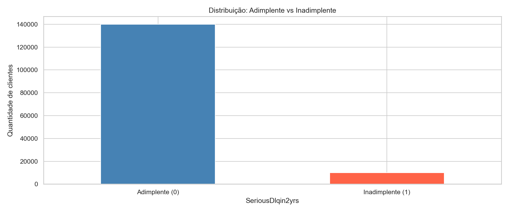
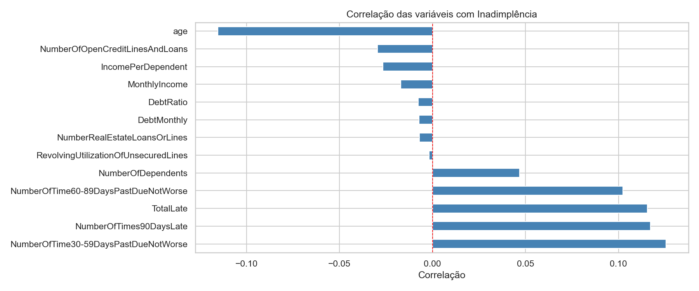
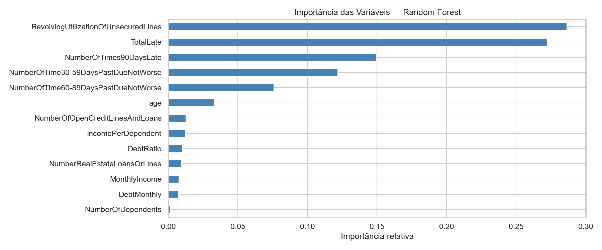
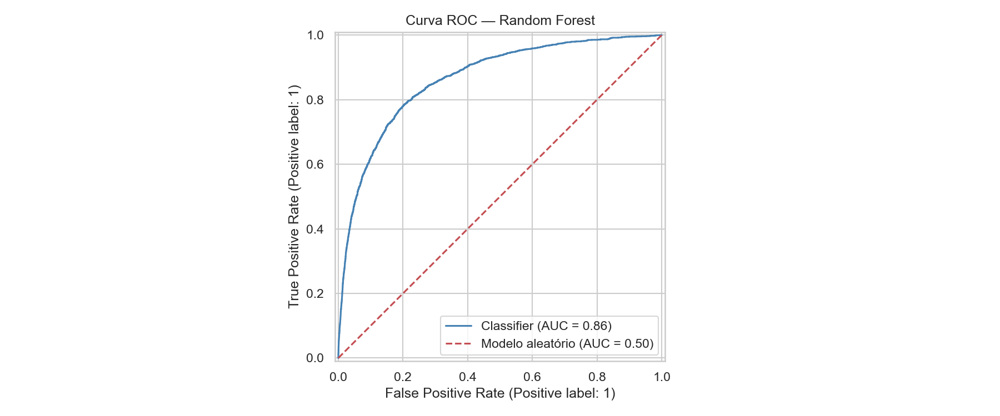
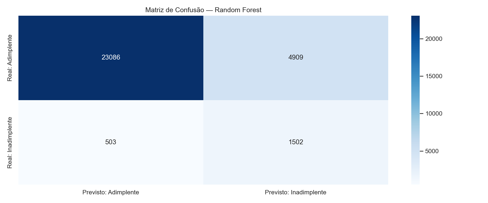

# Modelo Preditivo de Inadimplência de Crédito

Modelo de classificação binária para prever inadimplência em crédito pessoal, usando
Random Forest e o dataset **Give Me Some Credit** (Kaggle). AUC-ROC de **0,8645** e
recall de **75%** para a classe crítica (inadimplentes).

> Projeto de portfólio simulando o desafio de um Data Analyst em um time de crédito:
> antecipar quais clientes têm maior probabilidade de atrasar pagamentos por 90+ dias
> nos próximos 2 anos, a partir do histórico financeiro.

---

## Problema de Negócio

Um dos principais riscos de qualquer operação de crédito é a **inadimplência**. Prever
com antecedência quais clientes têm maior probabilidade de atrasar pagamentos permite:

- Ajustar a **política de concessão** (aprovação com condições diferenciadas ou recusa)
- Otimizar o **pricing** (taxa proporcional ao risco)
- Priorizar **cobrança preventiva** para a carteira já ativa

Este projeto treina um classificador para essa tarefa, usando dados históricos de
~150 mil clientes.

---

## Dataset

**Give Me Some Credit** — competição do Kaggle com dados reais anonimizados de crédito
pessoal ([link original](https://www.kaggle.com/competitions/GiveMeSomeCredit)).

- **149.999 registros** no conjunto de treino
- **10 features** financeiras e demográficas originais
- **Target:** `SeriousDlqin2yrs` (1 = cliente ficou 90+ dias em atraso nos últimos 2 anos)
- **Desbalanceamento importante:** apenas **6,7% dos clientes são inadimplentes** —
  cenário realista de crédito, e desafio central do projeto

### Principais colunas do dataset

| Coluna | Significado |
|---|---|
| `SeriousDlqin2yrs` | Target: 1 = inadimplente, 0 = adimplente |
| `RevolvingUtilization` | % do limite de crédito rotativo em uso |
| `age` | Idade do cliente |
| `NumberOfTime30-59DaysPastDueNotWorse` | Vezes que atrasou 30–59 dias |
| `DebtRatio` | Proporção dívida / renda |
| `MonthlyIncome` | Renda mensal |
| `NumberOfTimes90DaysLate` | Vezes que atrasou mais de 90 dias |
| `NumberOfDependents` | Número de dependentes na família |

---

## Stack Técnica

- **Python** — linguagem
- **pandas** — manipulação e limpeza
- **scikit-learn** — Random Forest, métricas, split
- **matplotlib / seaborn** — visualizações
- **Jupyter Notebook** — análise narrativa

---

## Metodologia

### 1. Análise Exploratória (EDA)

Distribuição da target confirma o forte desbalanceamento entre classes (93,3% vs. 6,7%):



Análise de correlações entre features:



### 2. Tratamento dos Dados

Dados reais nunca vêm perfeitos. Foram identificados dois problemas de valores ausentes:

- **`MonthlyIncome`** (renda): 19,8% dos clientes sem renda informada (~30 mil registros)
- **`NumberOfDependents`** (dependentes): 2,6% sem informação

**Decisão de imputação:** preenchimento pela **mediana**, não pela média. A mediana é
robusta a outliers — em uma distribuição de renda, um cliente com renda muito alta
distorce a média mas não afeta a mediana, que continua representando o cliente típico.

### 3. Feature Engineering

Foram criadas **3 novas variáveis** a partir das originais, para dar ao modelo
informações mais ricas:

| Feature criada | Lógica | Importância no modelo |
|---|---|---|
| **`TotalLate`** | Soma de todos os tipos de atraso do cliente | 🥈 **2º lugar (27,2%)** |
| **`DebtMonthly`** | Estimativa da dívida mensal em valor absoluto | Impacto menor |
| **`IncomePerDependent`** | Renda disponível por pessoa da família | Impacto moderado |

**Destaque:** a `TotalLate` ficou em **2º lugar de importância** no modelo — à frente
de variáveis originais como renda e idade. Isso confirma que Feature Engineering
agregou valor real, não foi só formalidade.

### 4. Modelagem — Random Forest

O algoritmo foi escolhido por três razões:

1. **Robustez a outliers** — árvores de decisão não sofrem com valores extremos
2. **Captura de relações não-lineares** entre features
3. **É o padrão de mercado em credit scoring** por ser interpretável e lidar bem
   com dados desbalanceados

#### Parâmetros utilizados

| Parâmetro | Valor | Justificativa |
|---|---|---|
| `n_estimators` | 100 | 100 árvores — bom equilíbrio entre performance e custo computacional |
| `max_depth` | 6 | Limita profundidade para evitar **overfitting** (modelo decorar em vez de aprender) |
| `class_weight` | `'balanced'` | Compensa o desbalanceamento 93%/7% dando mais peso à classe minoritária |
| `random_state` | 42 | Reprodutibilidade — mesmos resultados em qualquer execução |

**Por que `class_weight='balanced'` foi essencial:** sem esse ajuste, o modelo tenderia
a prever "adimplente" para quase todos os clientes — chegando a 93% de acurácia mas
com **recall zero para inadimplentes**. Ou seja, seria inútil na prática.

### 5. Interpretabilidade — Feature Importance

O modelo permite identificar quais variáveis mais contribuem para a decisão:



**As 5 variáveis mais importantes são todas ligadas a histórico de atrasos.** A renda
mensal aparece apenas em 11º lugar entre 14 variáveis — insight relevante que
detalho na seção de conclusões.

---

## Resultados

### AUC-ROC — Métrica Principal



O modelo atingiu **AUC-ROC de 0,8645**, classificado como BOM segundo padrões
de mercado:

| Faixa | Classificação |
|---|---|
| 0,50 | Chute aleatório — inútil |
| 0,70 – 0,80 | Aceitável |
| **0,80 – 0,90** | ✅ **Bom (este projeto)** |
| 0,90 – 1,00 | Excelente |

**Interpretação:** em 86% das comparações entre um cliente adimplente e um inadimplente
selecionados ao acaso, o modelo atribui probabilidade de risco maior ao inadimplente.

### Matriz de Confusão



Distribuição dos ~30.000 clientes do conjunto de teste:

|   | Previsto: Adimplente | Previsto: Inadimplente |
|---|---|---|
| **Real: Adimplente** | ✅ 23.086 | ❌ 4.909 (falsos alarmes) |
| **Real: Inadimplente** | ❌ 503 (não detectados) | ✅ 1.502 (detectados) |

**Recall de 75%** — o modelo identifica corretamente 3 em cada 4 inadimplentes reais.

### Por que 4.909 falsos alarmes são aceitáveis?

Em crédito, o custo de errar é **assimétrico**:

- **Falso positivo** (aprovar bom pagador com condições mais rígidas): perde-se
  margem, mas não capital
- **Falso negativo** (aprovar um inadimplente): perde-se o principal + juros +
  custo de cobrança

Trocar 4.909 falsos alarmes por 1.502 inadimplentes evitados é economicamente
favorável na maioria das políticas de crédito.

---

## Principais Insights

### 1. Comportamento supera renda como preditor

As **5 variáveis mais importantes do modelo são todas relacionadas a histórico de
atrasos**. Renda mensal aparece apenas em **11º lugar entre 14 variáveis**. Na prática:
*quanto* o cliente ganha importa menos que *como* ele paga suas contas.

Esse achado é consistente com a intuição do mercado de crédito — clientes de renda alta
que já atrasaram no passado tendem a atrasar novamente, e clientes de renda mais baixa
com histórico limpo tendem a manter o comportamento.

### 2. Feature Engineering fez diferença mensurável

A variável **`TotalLate`**, criada manualmente somando todos os tipos de atraso do
cliente, ficou em **2º lugar de importância (27,2%)** — à frente de todas as variáveis
originais do dataset. Isso mostra que entender o negócio e pensar nas variáveis certas
é tão importante quanto escolher o algoritmo.

### 3. Desbalanceamento exigiu tratamento explícito

Com apenas 6,7% de inadimplentes, ignorar o desbalanceamento faria o modelo prever
"adimplente" para praticamente todos — chegando a 93% de acurácia mas com recall
próximo de zero. O uso de `class_weight='balanced'` foi essencial para o modelo
efetivamente detectar a classe minoritária.

---

## Estrutura do Repositório

```
.
├── projeto2_inadimplencia.ipynb        # Notebook com toda a análise
├── cs-training.csv                     # Dataset (Give Me Some Credit / Kaggle)
├── grafico1_distribuicao_target.png    # Distribuição da variável target
├── grafico2_correlacoes.png            # Matriz de correlações
├── grafico3_feature_importance.png     # Importância das features
├── grafico4_curva_roc.png              # Curva ROC
├── grafico5_matriz_confusao.png        # Matriz de confusão
└── README.md
```

---

## Como Reproduzir

```bash
# 1. Clonar o repositório
git clone https://github.com/Lukk7x/modelo-inadimplencia-credito.git
cd modelo-inadimplencia-credito

# 2. Instalar dependências
pip install pandas scikit-learn matplotlib seaborn jupyter

# 3. Abrir o notebook
jupyter notebook projeto2_inadimplencia.ipynb
```

O `random_state=42` garante que os resultados sejam **reprodutíveis** — qualquer
pessoa executando o notebook obtém as mesmas métricas.

---

## Próximas Iterações

- **Comparar com outros algoritmos:** testar XGBoost e LightGBM para verificar ganho
  de performance
- **Técnicas de balanceamento avançadas:** aplicar SMOTE (geração sintética de exemplos
  da classe minoritária) e comparar com `class_weight='balanced'`
- **Otimização de hiperparâmetros:** usar GridSearchCV ou Optuna para refinar
  `n_estimators`, `max_depth` e outros parâmetros
- **Calibração de probabilidades:** analisar não só a classificação, mas se as
  probabilidades previstas são bem calibradas (importante para decisões de pricing)
- **Interpretabilidade avançada:** aplicar SHAP values para entender a contribuição
  de cada feature em previsões individuais — útil em ambientes regulados

---

*Desenvolvido por Lucas Abreu — projeto de portfólio em análise de dados aplicada ao
mercado financeiro.*
